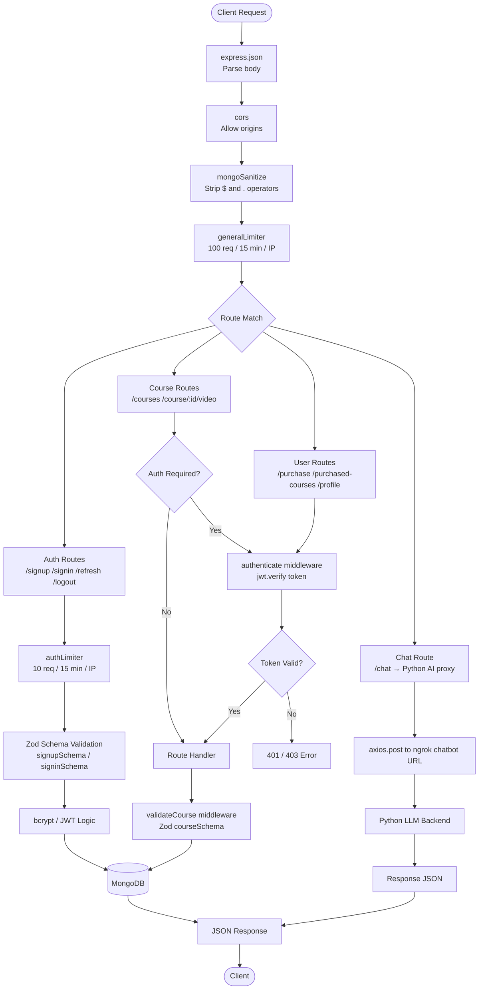

# 📚 Course Selling Web Application — Full-Stack MERN Platform

[](https://nodejs.org)
[](https://expressjs.com)
[](https://reactjs.org)
[](https://mongodb.com)
[](https://jwt.io)
[](https://vitejs.dev)
[](https://tailwindcss.com)
[](https://zod.dev)

> A **production-grade, full-stack course marketplace** built with the MERN stack. Features JWT refresh-token rotation, Axios interceptor-based silent token refresh, AI-powered chatbot integration, debounced search with suggestions, Zod schema validation, and multiple security layers including rate limiting and NoSQL injection prevention.

---

## 📌 Table of Contents

- [Overview](#-overview)
- [Tech Stack](#-tech-stack)
- [System Architecture](#-system-architecture)
- [Authentication Flow](#-authentication-flow)
- [Request Lifecycle](#-request-lifecycle)
- [Features](#-features)
- [Project Structure](#-project-structure)
- [Getting Started](#-getting-started)
- [API Reference](#-api-reference)
- [Security Highlights](#-security-highlights)
- [Key Implementation Details](#-key-implementation-details)
- [Author](#-author)

---

## 🔍 Overview

**AppStore** is a full-stack course-selling platform where users can browse courses, add them to a cart, make purchases, watch video content, leave ratings/reviews, and interact with an AI course assistant. The system implements production-grade security practices and is organized around a clean RESTful API.

The backend is a standalone **Express.js REST API** backed by **MongoDB via Mongoose**. The frontend is a **React 18 SPA** built with Vite and styled with Tailwind CSS.

---

## 🛠 Tech Stack

### Backend
| Technology | Purpose |
|---|---|
| **Node.js + Express.js** | REST API server, routing, middleware pipeline |
| **MongoDB + Mongoose** | NoSQL database with ODM schema enforcement |
| **JWT (jsonwebtoken)** | Access tokens (15 min) + Refresh tokens (7 days) |
| **bcrypt** | Password hashing with salt rounds |
| **Zod** | Request body schema validation |
| **express-rate-limit** | Brute-force and DDoS protection |
| **express-mongo-sanitize** | NoSQL injection prevention |
| **axios** | HTTP client for AI chatbot proxy requests |
| **dotenv** | Environment variable management |

### Frontend
| Technology | Purpose |
|---|---|
| **React 18** | Component-based UI with hooks |
| **Vite** | Fast build tool & dev server |
| **React Router v7** | Client-side routing with protected routes |
| **Axios** | HTTP client with request/response interceptors |
| **Tailwind CSS** | Utility-first CSS framework |
| **React Toastify** | Toast notifications |
| **FontAwesome** | Icon library |

### AI / ML
| Technology | Purpose |
|---|---|
| **Jupyter Notebook (Python)** | Chatbot model hosted as a Python backend |
| **ngrok** | Tunnel to expose local Python chatbot API |

---

## 🗺 System Architecture

```
┌─────────────────────────────────────────────────────────────────┐
│                        CLIENT (Browser)                         │
│                                                                 │
│  React 18 SPA (Vite)                                           │
│  ┌──────────┐ ┌───────────┐ ┌──────────┐ ┌─────────────────┐  │
│  │ Homepage │ │CourseDetail│ │ CartPage │ │ PurchasedCourses│  │
│  └──────────┘ └───────────┘ └──────────┘ └─────────────────┘  │
│  ┌──────────┐ ┌──────────┐  ┌──────────┐ ┌─────────────────┐  │
│  │ Profile  │ │  Chatbot │  │CourseVids│ │  Signin/Signup  │  │
│  └──────────┘ └──────────┘  └──────────┘ └─────────────────┘  │
│                                                                 │
│  AuthContext (useAuth hook + Axios interceptors)               │
│  localStorage: accessToken, refreshToken, userId, username     │
└──────────────────────┬──────────────────────────────────────────┘
                       │ HTTP/REST (JSON)
                       │ Authorization: Bearer <accessToken>
                       ▼
┌─────────────────────────────────────────────────────────────────┐
│              EXPRESS.JS SERVER (Port 3000)                      │
│                                                                 │
│  Middleware Pipeline:                                           │
│  [express.json()] → [cors()] → [mongoSanitize()] →            │
│  [generalLimiter: 100 req/15min] → [Routes]                   │
│                                                                 │
│  ┌──────────────────────────────────────────────────────────┐  │
│  │                    Route Handlers                        │  │
│  │                                                          │  │
│  │  /signup  /signin  /refresh  /logout   ← authLimiter    │  │
│  │  (10 req/15min per IP)                                   │  │
│  │                                                          │  │
│  │  /courses  /courses/:id  /courses/review                 │  │
│  │  /course/:id/video(s)                                    │  │
│  │                                                          │  │
│  │  /purchase  /purchased-courses  /profile/:userId         │  │
│  │                                                          │  │
│  │  /chat  (proxies to Python AI backend via ngrok)         │  │
│  └─────────────────┬────────────────────────────────────────┘  │
│                    │ authenticate middleware (JWT verify)       │
│                    │ validateCourse middleware (Zod parse)      │
└────────────────────┼────────────────────────────────────────────┘
                     │
        ┌────────────┴───────────┐
        │                        │
        ▼                        ▼
┌──────────────┐     ┌─────────────────────────┐
│   MongoDB    │     │  Python Chatbot Backend  │
│              │     │  (Jupyter Notebook)      │
│  Collections:│     │  Exposed via ngrok       │
│  ┌─────────┐ │     │  POST /api/chat          │
│  │  Users  │ │     └─────────────────────────┘
│  ├─────────┤ │
│  │ Courses │ │
│  └─────────┘ │
└──────────────┘
```

---

## 🔐 Authentication Flow

```
┌──────────────────────────────────────────────────────────────────────┐
│                        AUTHENTICATION FLOW                           │
└──────────────────────────────────────────────────────────────────────┘

  SIGNUP / SIGNIN
  ──────────────
  Client                  Express (authLimiter: 10/15min)          MongoDB
    │                              │                                   │
    │── POST /signup ─────────────▶│                                   │
    │                              │── Zod validate body               │
    │                              │── bcrypt.hash(password, 10) ─────▶│
    │                              │◀─ User.create() ──────────────────│
    │                              │── jwt.sign(userId, secret, 15m)   │
    │                              │── jwt.sign(userId, refresh, 7d)   │
    │                              │── user.refreshToken = token ─────▶│ (save)
    │◀── { accessToken, refreshToken, userId } ─────────────────────── │


  PROTECTED REQUEST
  ─────────────────
  Client                  Express                                  MongoDB
    │                        │                                        │
    │── GET /purchased ──────▶│                                        │
    │   Authorization:        │── authenticate middleware              │
    │   Bearer <accessToken>  │── jwt.verify(token, secret)           │
    │                        │── req.userId = decoded.userId          │
    │                        │── Route handler ──────────────────────▶│
    │◀── 200 { data } ────── │◀─────────────────────────────────────  │


  TOKEN REFRESH (Axios Interceptor — Silent, Client-Side)
  ───────────────────────────────────────────────────────
  Client                              Express
    │                                    │
    │── Any API call ───────────────────▶│
    │◀─ 401 { expired: true } ──────────│
    │                                    │
    │  [Axios response interceptor fires]│
    │── POST /refresh { refreshToken } ─▶│
    │                                    │── verify refreshToken
    │                                    │── check DB token matches
    │◀── { newAccessToken, newRefreshToken }
    │                                    │
    │  [Update localStorage]             │
    │  [Retry original request] ────────▶│
    │◀── 200 { data } ──────────────────│


  LOGOUT
  ──────
  Client ── POST /logout (with accessToken) ──▶ Express
                                                 │── user.refreshToken = null (DB)
  Client ── clear localStorage ◀──────────────── │
```

---

## 🔄 Request Lifecycle



---

## ✨ Features

### 🔐 Authentication & Session Management
- JWT **access token** (15-minute expiry) + **refresh token** (7-day expiry)
- **Refresh token rotation** — new token pair issued on every refresh
- **Axios interceptors** — expired access tokens are silently refreshed and the original request is retried, completely transparent to the user
- **Rate limiting** on auth routes: 10 requests per IP per 15 minutes (brute-force protection)
- Passwords hashed with **bcrypt** (salt rounds: 10)

### 🛍 Course Discovery
- Browse all courses on the homepage
- **Debounced search** (300ms delay) to filter courses by topic without hammering the API
- **Search suggestions** — up to 5 unique topic suggestions rendered in real time using `useMemo`

### 📋 Course Detail Page
- Full course metadata: description, price (discounted vs actual), ratings
- **Learn points** grid with FontAwesome check icons
- Reviews section with paginated "Show More / Show Less" functionality
- Sidebar card with Buy Now & Add to Cart buttons

### 🛒 Cart System
- **localStorage-based cart** keyed by `userId` — works without a cart API
- Add / Remove courses from the cart
- Confirm-purchase modal with backend call to persist to DB

### 🎬 Video Player (Purchased Users Only)
- Sidebar listing all course videos by title
- HTML5 `<video>` player with `ref`-based reload on video switch
- Protected route — redirects unauthenticated users

### ⭐ Ratings & Reviews
- Submit / update a rating (0–5) and comment for any purchased course
- Form validation with inline error messages before API call
- Optimistic UI update via `setCourse` on success

### 🤖 AI Course Chatbot
- Floating chatbot panel (toggleable) rendered globally across all routes
- Proxied through the Express backend (`POST /chat`) to a **Python LLM backend** (Jupyter Notebook) exposed via **ngrok**
- Markdown-like formatting: bold, bullet points, newlines rendered via `dangerouslySetInnerHTML`

### 👤 Profile Page
- Displays user name, email, and list of purchased courses
- Click a course to navigate to its detail page

### 💀 UX / Loading States
- **Skeleton cards** during purchased-courses fetch
- Toast notifications for all user actions (success, error, info) via React Toastify
- Disabled submit buttons with "Please wait..." text while requests are in flight

---

## 📁 Project Structure

```
resume-project/
│
├── Backend/                          # Node.js + Express API
│   ├── config/
│   │   └── config.js                 # dotenv exports (JWT_SECRET, MONGO_URI, etc.)
│   ├── middleware/
│   │   ├── authenticate.js           # JWT verify middleware → req.userId
│   │   ├── ratelimiter.js            # authLimiter (10/15min) + generalLimiter (100/15min)
│   │   └── validateCourse.js         # Zod courseSchema middleware
│   ├── models/
│   │   ├── User.js                   # Mongoose schema: name, email, password, purchasedCourses, refreshToken
│   │   └── Course.js                 # Mongoose schema: id, topic, description, prices, videos[], ratings[], images[], learnPoints[]
│   ├── routes/
│   │   ├── auth.routes.js            # POST /signup /signin /refresh /logout
│   │   ├── course.routes.js          # GET/POST /courses, review, video CRUD
│   │   ├── user.routes.js            # GET /profile/:id, POST /purchase, GET /purchased-courses
│   │   └── chat.routes.js            # POST /chat (proxy to Python AI)
│   ├── schemas/
│   │   └── zodschemas.js             # signupSchema, signinSchema, courseSchema, videoSchema, ratingSchema
│   ├── database.js                   # Named Mongoose connection with SIGINT graceful shutdown
│   ├── index.js                      # App entry: middleware pipeline + route mounting
│   ├── chatbot.ipynb                 # Jupyter Notebook: Python AI chatbot backend
│   └── package.json
│
├── frontend/
│   └── frontend-project/             # React 18 SPA (Vite)
│       ├── src/
│       │   ├── App.jsx               # Router setup, protected routes, AuthProvider wrapper
│       │   ├── main.jsx              # React DOM root
│       │   └── components/
│       │       ├── useAuth.jsx       # AuthContext: token storage, Axios interceptors, login/logout
│       │       ├── useDebounce.jsx   # Custom hook: debounce with configurable delay
│       │       ├── Navbar.jsx        # Responsive navbar (desktop + mobile)
│       │       ├── DesktopNav.jsx    # Desktop nav links
│       │       ├── MobileNav.jsx     # Hamburger menu nav
│       │       ├── Homepage.jsx      # Course listing with search + debounce
│       │       ├── Searchbar.jsx     # Controlled search input with dropdown suggestions
│       │       ├── Courselist.jsx    # Grid renderer for course cards
│       │       ├── CardComponent.jsx # Individual course card with Buy Now / Add to Cart
│       │       ├── CourseDetailPage.jsx  # Public course detail: description, learn points, reviews
│       │       ├── CourseDetails.jsx     # Authenticated video player page with review form
│       │       ├── CourseVideosPage.jsx  # Video index page
│       │       ├── CartPage.jsx      # localStorage cart management
│       │       ├── PurchasedCourses.jsx  # Authenticated list of owned courses with skeleton loader
│       │       ├── Profile.jsx       # User profile + purchased courses summary
│       │       ├── SigninForm.jsx     # Login form with rate-limit error handling
│       │       ├── SignupForm.jsx     # Registration form
│       │       ├── Chatbot.jsx       # Floating AI chat panel
│       │       ├── ChatMessage.jsx   # Chat message renderer with markdown-like formatting
│       │       ├── SkeletonCard.jsx  # Loading placeholder card
│       │       └── Renderstars.jsx   # Star rating renderer with average calculation
│       ├── index.html
│       ├── vite.config.js
│       ├── tailwind.config.js
│       └── package.json
│
├── .gitignore
└── README.md
```

---

## 🚀 Getting Started

### Prerequisites
- **Node.js** v16+
- **MongoDB** (local: `mongodb://127.0.0.1:27017` or MongoDB Atlas)
- **Python 3** + Jupyter (for the chatbot backend)
- **ngrok** (to expose the Python chatbot, optional)

---

### 1. Backend Setup

```bash
# Navigate to Backend directory
cd Backend

# Install dependencies
npm install

# Create your .env file
cat > .env << EOF
PORT=3000
MONGO_URI=mongodb://127.0.0.1:27017/your_db_name
JWT_SECRET=your_super_secret_access_key_here
JWT_REFRESH_SECRET=your_different_refresh_secret_here
NGROK_CHAT_URL=https://your-ngrok-url.ngrok-free.app
EOF

# Start the server (ES Modules — requires Node 16+)
node index.js
```

The server starts on `http://localhost:3000`.

> **Note:** `JWT_SECRET` and `JWT_REFRESH_SECRET` must be different strings for security.

---

### 2. Frontend Setup

```bash
# Navigate to frontend
cd frontend/frontend-project

# Install dependencies
npm install

# Build Tailwind CSS (run in a separate terminal)
npm run build:css

# Start the Vite dev server
npm run dev
```

The frontend starts on `http://localhost:5173`.

> **Axios base URL** is set to `http://localhost:3000` inside `useAuth.jsx`. Ensure the backend is running before starting the frontend.

---

### 3. Chatbot Setup (Optional)

```bash
# Navigate to Backend
cd Backend

# Start Jupyter and open chatbot.ipynb
jupyter notebook chatbot.ipynb

# Run all cells to start the Python chat API server
# Then expose it with ngrok:
ngrok http <chatbot_port>

# Copy the ngrok HTTPS URL into your .env:
NGROK_CHAT_URL=https://xxxx-xx-xx.ngrok-free.app
```

---

## 📡 API Reference

### 🔐 Authentication Routes
| Method | Endpoint | Body | Auth | Description |
|--------|----------|------|:----:|-------------|
| `POST` | `/signup` | `{ name, email, password }` | ❌ | Register a new user |
| `POST` | `/signin` | `{ email, password }` | ❌ | Login, receive token pair |
| `POST` | `/refresh` | `{ refreshToken }` | ❌ | Rotate token pair |
| `POST` | `/logout` | — | ✅ | Invalidate refresh token in DB |

> Auth routes are rate-limited: **10 requests per IP per 15 minutes**.

---

### 📚 Course Routes
| Method | Endpoint | Body / Params | Auth | Description |
|--------|----------|--------------|:----:|-------------|
| `GET` | `/courses` | — | ❌ | List all courses |
| `GET` | `/courses/:id` | — | ❌ | Get single course by ID |
| `POST` | `/courses` | Course object (Zod validated) | ❌ | Create a new course |
| `POST` | `/courses/review` | `{ id, rating, comment, userId }` | ✅ | Submit or update a review |
| `GET` | `/courses/:courseId/feedback` | — | ❌ | Get all feedback for a course |

---

### 🎬 Video Routes
| Method | Endpoint | Auth | Description |
|--------|----------|:----:|-------------|
| `POST` | `/course/:id/video` | ❌ | Add a video to a course |
| `GET` | `/course/:id/videos` | ❌ | List all videos for a course |
| `GET` | `/course/:id/video/:videoIndex` | ❌ | Get a specific video |
| `PUT` | `/courses/:id/video/:videoIndex` | ❌ | Update a video |
| `DELETE` | `/course/:id/video/:videoIndex` | ❌ | Delete a video |

---

### 👤 User Routes
| Method | Endpoint | Body | Auth | Description |
|--------|----------|------|:----:|-------------|
| `GET` | `/profile/:userId` | — | ❌ | Get user profile + purchased courses |
| `POST` | `/purchase` | `{ courseId }` | ✅ | Purchase a course |
| `GET` | `/purchased-courses` | — | ✅ | List all purchased courses for logged-in user |

---

### 🤖 Chat Route
| Method | Endpoint | Body | Auth | Description |
|--------|----------|------|:----:|-------------|
| `POST` | `/chat` | `{ query, context }` | ❌ | Proxy to Python AI chatbot |

---

## 🔒 Security Highlights

| Layer | Implementation | Details |
|---|---|---|
| **Password Storage** | `bcrypt.hash(password, 10)` | Salt rounds ensure unique hashes |
| **Access Tokens** | JWT signed with `JWT_SECRET` | 15-minute expiry |
| **Refresh Tokens** | JWT signed with `JWT_REFRESH_SECRET` | 7-day expiry, stored in DB |
| **Token Rotation** | New pair on every `/refresh` | Prevents replay attacks |
| **Rate Limiting** | `express-rate-limit` | Auth: 10/15min; General: 100/15min |
| **NoSQL Injection** | `express-mongo-sanitize` | Strips `$` and `.` from all request fields |
| **Schema Validation** | `zod` | All inputs validated before DB touch |
| **Auto Token Refresh** | Axios response interceptor | 401 + `expired: true` triggers silent refresh |
| **CORS** | `cors()` middleware | Enabled for frontend communication |

---

## 🧠 Key Implementation Details

These are the design decisions worth discussing in technical interviews:

### 1. Dual-Token JWT Strategy
The system uses **short-lived access tokens (15m)** alongside **long-lived refresh tokens (7d)**. The refresh token is stored in MongoDB, so it can be revoked server-side on logout. On `/refresh`, both tokens are rotated — the old refresh token is replaced in the DB, preventing reuse.

### 2. Silent Token Refresh via Axios Interceptors
`useAuth.jsx` registers an Axios **response interceptor** that catches any `401` response with `expired: true`. It then automatically calls `/refresh`, updates `localStorage`, and **retries the original failed request** — all transparently, without user action.

```js
// Simplified from useAuth.jsx
axios.interceptors.response.use(
  (response) => response,
  async (error) => {
    if (error.response?.status === 401 && error.response?.data?.expired) {
      const { data } = await axios.post('/refresh', { refreshToken });
      localStorage.setItem('accessToken', data.accessToken);
      error.config.headers.Authorization = `Bearer ${data.accessToken}`;
      return axios(error.config); // retry original request
    }
    return Promise.reject(error);
  }
);
```

### 3. Performance Optimizations on Homepage
- `useDebounce(searchQuery, 300)` — delays filtering until the user stops typing, reducing re-renders
- `useMemo` for `filteredCourses` and `suggestions` — avoids recomputing on unrelated state changes
- `useCallback` wrapping `fetchCourses` — stable function reference for `useEffect` dependency

### 4. Zod Schema Validation
All incoming data is validated with Zod **before** it touches the database:
- `signupSchema` / `signinSchema` for auth
- `courseSchema` (nested: `videoSchema[]`, `ratingSchema[]`) for course creation
- The `validateCourse` middleware parses and replaces `req.body` with the typed, validated result

### 5. Named Mongoose Connection
`database.js` uses `mongoose.createConnection()` instead of `mongoose.connect()`. This creates a **named connection** exported as `dbConnection`, giving explicit control over connection lifecycle and enabling graceful shutdown on `SIGINT`.

### 6. Client-Side Cart with localStorage
Cart state is stored in `localStorage` keyed by `userId` — allowing multiple users on the same machine to have separate carts without a cart API. The purchase API is only called when confirming checkout.

### 7. AI Chatbot Architecture
The chatbot is a two-service system: the Express backend proxies POST requests to a Python backend (Jupyter Notebook serving an API), exposed via ngrok. This decouples the ML logic from the Node.js server and allows swapping the AI backend independently.

---

## 🗂 MongoDB Schema Design

### User Collection
```
{
  name:             String (required)
  email:            String (required, unique)
  password:         String (bcrypt hash)
  purchasedCourses: [String]     ← array of course IDs
  refreshToken:     String | null
}
```

### Course Collection
```
{
  id:              String (unique)
  topic:           String
  description:     String
  actualPrice:     Number (min: 0)
  discountedPrice: Number (min: 0)
  images:          [String]
  learnPoints:     [String]
  purchasedBy:     [ObjectId → User]
  ratings: [{
    userId:   ObjectId → User
    username: String
    rating:   Number (0–5)
    comment:  String
  }]
  videos: [{
    title:      String
    url:        String
    thumbnail:  String
    duration:   String  ← hh:mm:ss format
    videoIndex: Number
    resources:  [String]
    createdAt:  Date
    updatedAt:  Date
  }]
}
```

---

## 🌐 Frontend Routing

| Path | Component | Auth Required |
|------|-----------|:---:|
| `/` | `Homepage` | ❌ |
| `/signup` | `SignupForm` | ❌ (redirects if logged in) |
| `/signin` | `SigninForm` | ❌ (redirects if logged in) |
| `/course-detail/:courseId` | `CourseDetailPage` | ❌ |
| `/courses/:courseId/videos` | `CourseDetails` | ✅ |
| `/purchased-courses` | `PurchasedCourses` | ✅ |
| `/cart` | `CartPage` | ✅ |
| `/profile` | `Profile` | ✅ |

> `<Chatbot />` is rendered globally outside the route tree — visible on all pages.

---

## 👨‍💻 Author

**Ayush Garg**
- GitHub: [@ayushgarg2005](https://github.com/ayushgarg2005)
- University: Netaji Subhas University of Technology, B.Tech CS & DS (2023–Present)

---

## 📄 License

This project is open source and available under the [MIT License](LICENSE).
