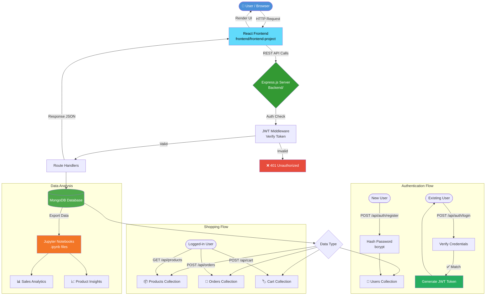

# 🛒 Course Web Development — Full-Stack E-Commerce Platform

[](https://nodejs.org)
[](https://expressjs.com)
[](https://reactjs.org)
[](https://mongodb.com)
[](https://jwt.io)
[](https://jupyter.org)

> A **full-stack e-commerce web application** built with the MERN stack, featuring secure JWT-based authentication, RESTful API architecture, and data analysis notebooks for product/sales insights.

---

## 📌 Table of Contents

- [Overview](#-overview)
- [Tech Stack](#-tech-stack)
- [Architecture & Flow Diagram](#-architecture--flow-diagram)
- [Features](#-features)
- [Project Structure](#-project-structure)
- [Getting Started](#-getting-started)
- [API Endpoints](#-api-endpoints)
- [Data Analysis (Jupyter)](#-data-analysis-jupyter)
- [Screenshots](#-screenshots)

---

## 🔍 Overview

This project is a production-style **e-commerce platform** where users can browse products, add to cart, place orders, and manage their accounts securely. The backend serves a fully documented REST API, while the frontend delivers a smooth React-based shopping experience. Jupyter Notebooks are included for exploratory data analysis on product and sales data.

---

## 🛠 Tech Stack

| Layer | Technology |
|---|---|
| **Frontend** | React.js, CSS3, HTML5 |
| **Backend** | Node.js, Express.js |
| **Database** | MongoDB (via Mongoose ODM) |
| **Authentication** | JWT (JSON Web Tokens) + bcrypt |
| **Data Analysis** | Jupyter Notebook, Python |
| **Version Control** | Git & GitHub |

---

## 🗺 Architecture & Flow Diagram



---

## ✨ Features

### 🔐 Authentication & Security
- User registration and login with **JWT-based session management**
- Password hashing using **bcrypt**
- Protected routes — only authenticated users can place orders or access cart

### 🛍 Shopping Experience
- Browse and search products
- Add/remove items from cart
- Place and track orders

### 🧑‍💼 Admin / Backend
- RESTful API design following standard HTTP methods (GET, POST, PUT, DELETE)
- Mongoose schemas with data validation
- Error handling middleware

### 📊 Data Analysis
- Jupyter Notebooks for analyzing product trends and order patterns
- Exploratory data analysis (EDA) on sales data

---

## 📁 Project Structure

```
course-web-development/
│
├── Backend/                    # Node.js + Express server
│   ├── models/                 # Mongoose schemas (User, Product, Order, Cart)
│   ├── routes/                 # Express route definitions
│   ├── middleware/             # JWT auth middleware
│   ├── controllers/            # Business logic
│   └── server.js               # App entry point
│
├── frontend/
│   └── frontend-project/       # React application
│       ├── src/
│       │   ├── components/     # Reusable UI components
│       │   ├── pages/          # Page-level components
│       │   ├── context/        # React Context for state management
│       │   └── App.js
│       └── public/
│
├── *.ipynb                     # Jupyter Notebooks — data analysis
├── .gitignore
└── README.md
```

---

## 🚀 Getting Started

### Prerequisites
- Node.js (v16+)
- MongoDB (local or Atlas)
- Python 3 + Jupyter (for notebooks)

### Backend Setup

```bash
# Navigate to backend
cd Backend

# Install dependencies
npm install

# Create .env file
echo "MONGO_URI=your_mongodb_connection_string
JWT_SECRET=your_jwt_secret
PORT=5000" > .env

# Start the server
npm start
```

### Frontend Setup

```bash
# Navigate to frontend
cd frontend/frontend-project

# Install dependencies
npm install

# Start React app
npm start
```

### Jupyter Notebooks

```bash
# From root directory
jupyter notebook
```

---

## 📡 API Endpoints

| Method | Endpoint | Description | Auth Required |
|--------|----------|-------------|:---:|
| `POST` | `/api/auth/register` | Register new user | ❌ |
| `POST` | `/api/auth/login` | Login & receive JWT | ❌ |
| `GET` | `/api/products` | Get all products | ❌ |
| `GET` | `/api/products/:id` | Get single product | ❌ |
| `POST` | `/api/cart` | Add item to cart | ✅ |
| `GET` | `/api/cart` | View cart | ✅ |
| `POST` | `/api/orders` | Place an order | ✅ |
| `GET` | `/api/orders` | View order history | ✅ |

---

## 📊 Data Analysis (Jupyter)

The Jupyter Notebooks in this project provide:

- **Product Analysis** — price distribution, category breakdowns
- **Sales Trends** — order volume over time, revenue metrics
- **User Behaviour** — cart abandonment, popular items

These notebooks demonstrate practical application of **Python data analysis** (pandas, matplotlib) integrated into a real-world web project.

---

## 🤝 Contributing

Pull requests are welcome! For major changes, please open an issue first to discuss what you would like to change.

---

## 👨‍💻 Author

**Ayush Garg**
- GitHub: [@ayushgarg2005](https://github.com/ayushgarg2005)

---

## 📄 License

This project is open source and available under the [MIT License](LICENSE).
